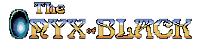

# Onyx of Black

[ [Engligh](README.md) | [日本語](README.ja.md) ]

## Overview

A retro style role-playing game made in Python.  
Explore dungeons, fight monsters, and find the legendary black onyx.  

## Requirements

- Python 3.7 leter.
- Pyxel 1.4.3 leter.
- Overrides 3.1.0 leter.

## Story

The Black Onyx is a hidden treasure.  
They say that if you get it, it will give you unlimited power and wealth.  
It was said to be somewhere in the Black Tower in the city of Utsuro.  
Upon hearing this story, you decide to seek out this mysterious treasure.  
You head for the ruins of the city, which are said to lead to the Black Tower.  

## How to Install

This chapter is a work in progress.  

## How to Play

### Character make

- When you play for the first time, you create a character.
- Decide on a name, and choose your favorite hairstyle and clothing.
- You can create five different characters.

### City

- When the game starts, the player is in a city. (It's called the city of Uturo.)
- The operation is as follows:
    - Use the left, right and down cursor keys to change the direction.
    - Use the up cursor key to move forward.
    - Press the spacebar to open the camp menu.
    - In the camping menu, you can take medicine if you have it to recover your strength, or save and suspend the game.
- See a doctor to restore your physical strength and check your ability values.

### Dungeon

- There is a dungeon underneath this city, but the entrance is hidden.
- The dungeons are filled with monsters. Prepare your equipment and strengthen your character to take on the challenge.

### Battle

- When you encounter monsters or other adventurers, you will enter into battle.
- When you enter a battle, you can choose from the following actions:
    - [A] Attack : Select the opponent to attack.
    - [T] Talk : Monsters are not worth talking about.
    - [R] Runaway : You don't always get away with it.
- You win by annihilating your opponent and gain experience. If your opponent has gold, you will also get gold.
- If all the player characters are wiped out, the game is over.

